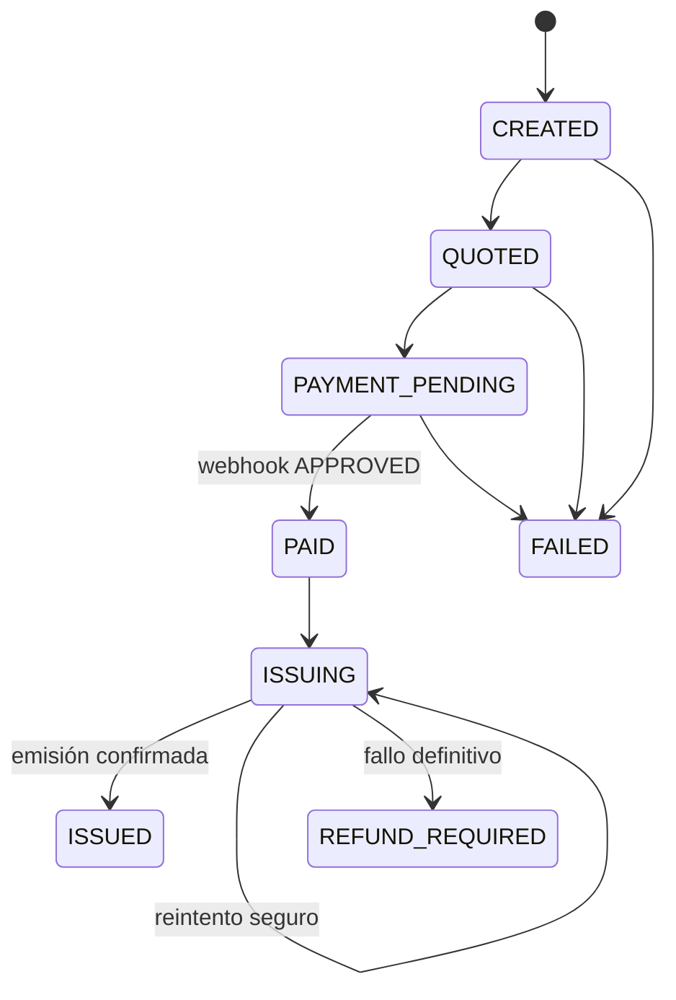

# Insurance Purchase Platform - Technical Leadership Assessment

Solución de alcance reducido y terminado para orquestar la compra de una póliza frente a terceros que fallan de manera independiente.

## Inicio rápido

```bash
cp .env.example .env
docker compose up --build
```

Validación rápida:

```bash
bash scripts/smoke-test.sh
```

## Demostración del flujo

```bash
curl -X POST http://localhost:8080/orders \
  -H 'Content-Type: application/json' \
  -H 'Idempotency-Key: demo-001' \
  -d '{"plate":"ABC123"}'

curl http://localhost:8080/orders

curl -X POST http://localhost:8082/chaos/issuer-outage \
  -H 'Content-Type: application/json' \
  -d '{"seconds":30}'
```

La consola operativa queda disponible en `http://localhost:3000` y RabbitMQ Management en `http://localhost:15672`.

Servicios previstos:

| Componente | Tecnología | Puerto | Responsabilidad |
|---|---|---:|---|
| Orchestrator | Go | 8080 | Estado de la orden, idempotencia, outbox, reintentos y reconciliación |
| Issuer service | C#/.NET | 8081 | Capa anticorrupción frente al emisor legado |
| Simulators | TypeScript | 8082 | Cotizador, PSP y emisor con inyección de caos |
| Ops console | Next.js | 3000 | Consulta, trazabilidad y acciones operativas |
| PostgreSQL | PostgreSQL | 5432 | Órdenes, eventos, idempotencia y outbox |
| Broker | RabbitMQ | 5672 | Procesamiento asíncrono, reintentos y DLQ |

## Flujo y estados



## Decisiones principales

1. **PostgreSQL como fuente de verdad.** La máquina de estados se persiste y cada transición genera un evento auditable.
2. **Outbox transaccional.** La orden y el evento se guardan en la misma transacción; un publicador independiente entrega el evento al broker.
3. **Procesamiento al menos una vez.** Se asumen mensajes duplicados y se neutralizan mediante claves de idempotencia y restricciones únicas.
4. **Timeout no equivale a fallo.** Antes de reintentar una emisión se consulta al legado por `externalRef`. Esto evita pólizas duplicadas.
5. **Reembolso supervisado.** `REFUND_REQUIRED` crea trabajo operativo; no se devuelve dinero automáticamente porque una emisión puede existir aunque la respuesta se haya perdido.
6. **Polling optimizado en la consola.** Para el assessment es más simple de operar y explicar que WebSockets; usa intervalos solo mientras la vista está activa. En producción se evaluaría SSE.
7. **Datos sensibles fuera de logs.** Se registra `correlationId`, `orderId`, estado y código de error; documento y placa se enmascaran.

## Alcance y renuncias

Incluido en el MVP: compra E2E, webhook firmado, máquina de estados, reconciliación, DLQ, capa anticorrupción, consola operativa, simulación de caos y pruebas de reglas críticas.

Excluido deliberadamente: prototipo móvil opcional, autenticación empresarial completa, infraestructura Terraform productiva y pruebas de carga a escala. Se documentan sus diseños, pero no se sacrifica calidad del flujo principal para implementarlos parcialmente.

## Criterio de escalabilidad

El objetivo de 10.000 órdenes/día y picos de 50 solicitudes/s permite escalar horizontalmente servicios sin estado. PostgreSQL concentra consistencia; los workers absorben picos y el broker desacopla al emisor. La telemetría no comparte este flujo transaccional: debe ir por un pipeline separado para evitar que el volumen de posiciones afecte pagos y emisión.

## Seguridad mínima

- HMAC con comparación constante para webhooks.
- Secretos por variables de entorno; nunca en el repositorio.
- Correlation ID validado o generado en el borde.
- Acciones operativas auditadas con actor, fecha, motivo y resultado.
- Logs estructurados sin documento ni placa completos.

## Uso de IA

El registro detallado se mantendrá en `docs/AI_USAGE.md`, incluyendo prompt, propuesta, decisión humana, correcciones y elementos descartados.

## Entregables documentales

- `review/README.md`: 24 hallazgos con evidencia y priorización.
- `review/PR_HANDOFF.md`: publicación del PR correctivo dentro del fork.
- `docs/MOBILE_DECISION.md`: decisión React Native y diseño de telemetría.
- `docs/AWS_ARCHITECTURE.md`: arquitectura, operación, continuidad y costos.
- `docs/LEADERSHIP.md`: contratación, mensaje al senior, checklist y DoD.
- `docs/TEST_PLAN.md`: escenarios y evidencias.
- `docs/VIDEO_AND_INTERVIEW.md`: guion y preparación de sustentación.

## Verificación pendiente antes de presentar

El código TypeScript fue compilado en el entorno de elaboración. La validación de Go, .NET y Docker Compose debe ejecutarse en una máquina con Go 1.23, .NET 8 y Docker, o mediante el workflow incluido. No debe afirmarse que el pipeline está verde hasta disponer de la URL real de GitHub Actions.
