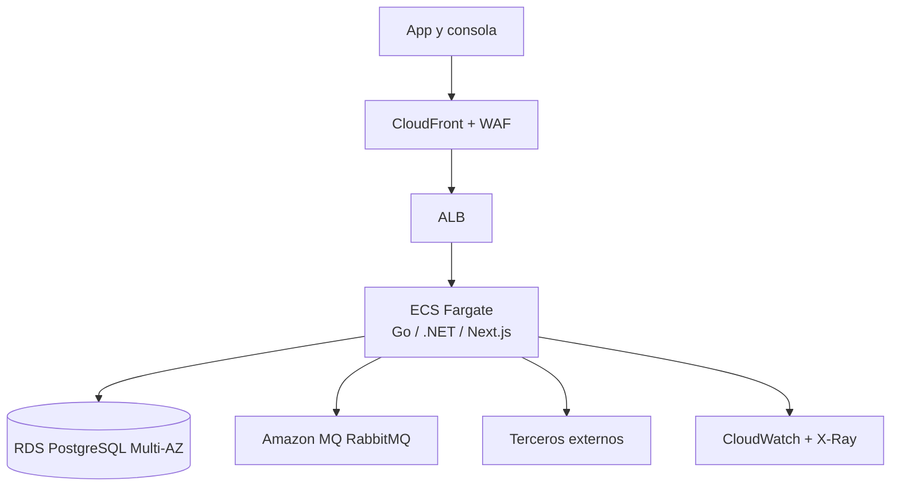

# Arquitectura AWS, operación y costos

## Recomendación

Se elige ECS Fargate sobre EKS porque la carga objetivo -10.000 órdenes diarias y picos de 50 solicitudes/s- no justifica asumir el costo operativo de Kubernetes. Lambda tampoco es la primera opción: workers, conexiones persistentes, circuit breaker y procesamiento de colas se explican y operan mejor como servicios contenedorizados. La decisión se revisaría si la organización ya opera EKS con una plataforma madura o si el patrón de carga se vuelve extremadamente intermitente.

## Diseño

- Dos zonas de disponibilidad, subredes privadas y salida controlada mediante NAT.
- ALB para API y consola; WAF, TLS y rate limiting en el borde.
- ECS services separados para orquestador, emisor, consola y workers; escalado por CPU, latencia, RPS y profundidad de cola.
- RDS PostgreSQL Multi-AZ, cifrado KMS, backups automáticos, PITR y réplicas de lectura solo cuando la medición lo justifique.
- Amazon MQ for RabbitMQ Multi-AZ para mantener compatibilidad AMQP y reducir administración.
- Secrets Manager, roles IAM por tarea y rotación de credenciales.
- ECR con escaneo de imágenes y despliegue blue/green.

## Observabilidad y SLO

SLO propuesto: 99,9% mensual para creación de órdenes; 99% de webhooks procesados en menos de 60 segundos; 99% de emisiones confirmadas o clasificadas para intervención en menos de 10 minutos. Métricas: latencia y errores por tercero, órdenes por estado/edad, outbox pendiente, profundidad/DLQ, circuit breaker, reconciliaciones, duplicados neutralizados y acciones operativas. Alarmas por burn rate, no solo por CPU.

## Continuidad

- RTO: 60 minutos; RPO: 5 minutos para el flujo transaccional.
- Restauración trimestral verificada, no solo existencia de backups.
- Runbooks para caída del emisor, acumulación de cola, fallo de webhook y recuperación de base.
- Degradación segura: aceptar órdenes y diferir emisión cuando el tercero no esté disponible; nunca perder el pago ni duplicar pólizas.

## Costos

La estimación debe generarse con AWS Pricing Calculator en la región elegida antes de entregar cifras. Presentar un rango mensual con supuestos de tareas mínimas/máximas, RDS Multi-AZ, broker, NAT, logs y transferencia. Los principales impulsores son RDS, Amazon MQ, NAT y retención de logs, no el volumen de 10.000 órdenes/día. Etiquetas por ambiente/producto, budgets y revisión FinOps mensual son obligatorios.

